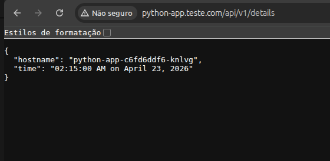

# install requirements

python3 -m venv venv
pip3 install -r requirements.tx

# docker login

docker login -u vandersonj
Personal Token

# docker resgistry push

docker push vandersonj/python-app:tagname

# Install Kind Ubunut

[ $(uname -m) = x86_64 ] && curl -Lo ./kind https://kind.sigs.k8s.io/dl/v0.29.0/kind-linux-amd64
chmod +x ./kind
sudo mv ./kind /usr/local/bin/kind
teste ->  kind version

# Install kubectl

curl -LO "https://dl.k8s.io/release/$(curl -L -s https://dl.k8s.io/release/stable.txt)/bin/linux/amd64/kubectl"
chmod +x ./kubectl
sudo mv ./kubectl /usr/local/bin/kubectl
teste -> kubectl version

# Kind ingress nginx

cat <<EOF | kind create cluster --config=-
kind: Cluster
apiVersion: kind.x-k8s.io/v1alpha4
nodes:
 - role: control-plane
   kubeadmConfigPatches:
   - |
     kind: InitConfiguration
     nodeRegistration:
       kubeletExtraArgs:
          node-labels: "ingress-ready=true"
   extraPortMappings:
   - containerPort: 80
     hostPort: 80
     protocol: TCP
   - containerPort: 443
     hostPort: 443
     protocol: TCP
EOF

# teste de execução

